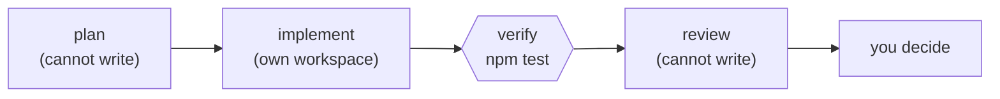

# geng

A DAG runner for AI coding agents: a node is a subprocess, an edge is a file, the exit code is the contract.

[](https://github.com/AdityaIndoori/graph-engineering/actions/workflows/ci.yml)
[](LICENSE)
[](https://www.python.org/downloads/)

## Table of contents

- [The problem](#the-problem)
- [The idea](#the-idea)
- [What geng is](#what-geng-is)
- [Try it in 60 seconds](#try-it-in-60-seconds)
- [Learn it](#learn-it)
- [Install](#install)
- [Why the exit code and not the agent's output](#why-the-exit-code-and-not-the-agents-output)
- [How the pieces fit](#how-the-pieces-fit)
- [Use the harness you already have](#use-the-harness-you-already-have)
- [Three worked examples](#three-worked-examples)
- [When not to use this](#when-not-to-use-this)
- [Spec reference](#spec-reference)
- [Verified behaviour](#verified-behaviour)
- [Alternatives](#alternatives)
- [Contributing](#contributing)
- [License](#license)

## The problem

You have an AI coding agent. You want it to do a real job: *add request-id logging
to the HTTP layer, then make sure the tests still pass.*

The obvious approach is to give one agent the whole job and let it iterate until it
says it is finished. People call that a **loop**, and two things go wrong with it.
Both are structural, so neither is fixable by writing a better prompt.

**It forgets.** Everything the agent does accumulates in one context window. Once
that window is in the hundreds of thousands of tokens, the early work is
effectively out of view. On a change spanning forty files, file three is forgotten
by the time it reaches file thirty.

**It grades its own homework.** The same agent that wrote the code decides whether
the code is good, and it reports success. This is the more damaging of the two,
because you cannot trust the verdict: the thing being judged and the judge are the
same thing, with the same blind spots and the same motivation to be finished.

## The idea

Split the job into separate steps. Each step is its own agent run with its own
fresh context, and the steps are connected in a defined order. That is a graph —
boxes and arrows.



Each of the two problems above now has an answer:

- **Forgetting** is solved because every step starts with a clean context holding
  only what it needs, passed in explicitly.
- **Self-grading** is solved because `verify` is *not an agent*. It is your actual
  test suite. It returns pass or fail and cannot be talked out of it.

And splitting the work buys a third thing the loop could not offer. Because each
step is a separate invocation, each step can be given **different capabilities**.
The `review` step above is handed no editing tools at all, so it physically cannot
"helpfully" fix the thing it was asked to judge — it has to tell you instead.

That per-step capability control is the genuinely valuable part of this idea, and
it is worth one concrete example.

The standard way to build a refund bot is to write instructions listing ten checks
a refund must pass, then give the agent a tool that issues refunds. What you have
actually done is **hand it the power to move money, with a polite note about how
you would prefer that power be used.** It works only if the agent reads the
instructions, follows them in order, targets the right customer, and nobody
injected anything misleading into its context.

Split it into two steps and the checking step *does not have the refund tool at
all*. The capability arrives only after the check has passed. That is a boundary
rather than a request, and it is what the rest of this tool exists to make easy.

## What geng is

`geng.py` is a single Python file (~600 lines, standard library only) that executes
graphs like the one above.

You describe the graph in TOML. `geng` runs the steps in dependency order, runs
independent steps concurrently, stops when a gate fails, and remembers what already
succeeded so a re-run skips it.

If you have used `make` or a GitHub Actions workflow, this is that — except the
steps are agent invocations rather than compile commands.

Three sentences define the whole model, and everything else in this README follows
from them:

- **A node is a subprocess.** One node is one run of one command line.
- **An edge is a file.** A node's output is captured to disk and substituted into
  the prompts of nodes that declared a dependency on it.
- **The exit code is the contract.** `0` means success, anything else means
  failure. There is a whole section on [why](#why-the-exit-code-and-not-the-agents-output).

## Try it in 60 seconds

You do not need an AI agent installed to see this work. The bundled example uses
plain Python subprocesses as its "agents", so the machinery is visible without
spending a token:

```console
$ git clone https://github.com/AdityaIndoori/graph-engineering
$ cd graph-engineering
$ python geng.py run examples/smoke.toml

wave 1  (3 node(s), 4 at a time)
  ok   youtube
  ok   reddit
  ok   twitter

wave 2  (1 node(s), 4 at a time)
  ok   report

wave 3  (2 node(s), 4 at a time)
  ok   verify
  ok   flaky

6/6 ok, 0 failed, 0 skipped
```

Read that output against the model above. Three nodes had no dependencies, so they
ran together in **wave 1**. `report` depended on all three, so it waited for wave 2
and received their output through `{placeholder}` edges. `verify` is a gate that
checked the result, and `flaky` is a node that fails twice before passing, to
demonstrate retries.

Run it again with `--resume` and every node reports `cached` in about a fifth of a
second. Change one prompt and only that node and its dependents re-run.

To see the shape without executing anything:

```console
$ python geng.py plan examples/smoke.toml
```

## Learn it

Four tutorials, in the order they are worth reading:

| | |
| --- | --- |
| [**TUTORIAL.md**](docs/TUTORIAL.md) | **Start here.** Builds a graph from an empty file — one node, then edges, a gate, parallel steps, isolation. Uses Python as a stand-in agent, so parts 1–4 need no AI CLI installed and cost nothing. |
| [TUTORIAL_OMP.md](docs/TUTORIAL_OMP.md) | The same patterns with Oh My Pi doing real work. Every command in it was executed while writing it. |
| [TUTORIAL_CLAUDE.md](docs/TUTORIAL_CLAUDE.md) | The same patterns with Claude Code. |
| [TUTORIAL_AI_WRITES_IT.md](docs/TUTORIAL_AI_WRITES_IT.md) | Describe what you want in English and have an agent write the TOML — including how to validate it before it runs. |

That last one needs one thing to work: [`docs/GENG_FOR_AI.md`](docs/GENG_FOR_AI.md),
a single file containing the complete schema and rules. Agents have no reliable
knowledge of `geng` (the name collides with an unrelated Rust crate), so without it
they correctly refuse — or worse, guess. Hand them that file and they produce valid
specs.

The [spec reference](#spec-reference) below is the lookup table for once you know
the concepts.

## Install

There is nothing to install. Copy one file next to the repository you want to work
in:

```console
$ curl -O https://raw.githubusercontent.com/AdityaIndoori/graph-engineering/main/geng.py
```

**Prerequisites**

| Requirement | Why |
| --- | --- |
| Python 3.11+ | `tomllib` entered the standard library in 3.11 |
| `git` | Only for `isolate = true` nodes; everything else works without it |
| An agent CLI | Any one of the eight below. Not needed for the example above |

There is deliberately no `pip install`. The premise is one file you drop next to a
repo and delete when you are done; shipping a package would contradict it.

## Why the exit code and not the agent's output

After every node, `geng` must answer one question: **did that step succeed?**

There are only two possible sources for the answer. The first is to read what the
agent printed — many of them can emit structured JSON with a status field. The
second is the process exit code, which every program on every operating system
returns, and where `0` has meant success since Unix.

`geng` uses the exit code, because the first option does not survive contact with
reality:

- **Cursor** emits no valid JSON when it fails — so the exact moment you most need
  to detect a failure is the moment your parser receives garbage.
- **Kiro** and **aider** have no JSON output mode at all. There is nothing to parse.
- **Claude Code**, **Codex** and **Gemini** all offer JSON, in three mutually
  incompatible shapes. That is three parsers to write and keep working.

So JSON is worth knowing about only long enough to reject it as a success signal.
Exit codes are universal, and they are the one thing every harness in the table
below already agrees on — which is exactly why switching harness is a one-line
change.

You can still *use* an agent's JSON: geng captures whatever a node prints and hands
it to the next node. It just never uses it to decide whether the node worked.

## How the pieces fit

Four properties follow from the three-sentence model, and each solves a specific
problem introduced above.

**Files carry state, not context windows.** Each node's stdout is captured to
`.geng/out/<node>.txt` and substituted into dependent prompts as `{node}`.
Referencing a node you did not declare in `needs` is a hard error, not an empty
string — so a graph cannot quietly look connected while passing nothing. This is
what makes the clean-context property real rather than aspirational.

**Capability is set per node.** Because a node is just a command line, a read-only
reviewer is simply a different command line — `claude -p --allowedTools Read,Grep,Glob`
instead of the writing one. This is the refund-bot boundary from
[The idea](#the-idea), expressed in one line of config.

**`isolate = true` gives a node its own git worktree** — a separate checkout on its
own branch. Two nodes can then edit the same file concurrently without touching
each other or your working directory. Work is committed only if the node
succeeded, so a half-finished edit can never be mistaken for something reviewable.

**Resume is keyed on content.** Each node's key is
`sha256(id + prompt + argv + upstream keys)`. Edit one prompt and `--resume`
re-runs exactly that node and its dependents. Because a failure costs you one node
rather than the whole run, many small nodes beat one large one.

## Use the harness you already have

Every one of these exposes a non-interactive command and a meaningful exit code,
which is all `geng` needs. Ready-to-paste blocks live in
[`adapters.toml`](adapters.toml).

| Harness | Adapter |
| --- | --- |
| Claude Code | `claude -p` &middot; `--allowedTools` &middot; `--bare` for CI |
| Oh My Pi | `omp -p --no-session --auto-approve` |
| OpenAI Codex | `codex exec` &middot; `--sandbox read-only\|workspace-write` |
| OpenCode | `opencode run --auto` &middot; `--agent` |
| Kiro CLI | `kiro-cli chat --no-interactive` &middot; `--trust-tools=read,grep` |
| Gemini CLI | `gemini -p` &middot; `--output-format json` |
| Cursor | `cursor-agent -p -f` (without `-f` it proposes but never applies) |
| Amp | `amp -x` &middot; `--stream-json` |
| aider | `aider --yes-always --message` |

Each also has a read-only twin, which is how the capability boundary gets enforced:

```toml
[agents.review]
argv = ["claude", "-p", "--allowedTools", "Read,Grep,Glob"]
```

Two cautions, both found by testing rather than reading docs. For `omp`, the
read-only boundary is `--approval-mode always-ask` — `--tools` looks like it
restricts capability and does not. And for gate nodes, avoid
`["bash", "-lc", ...]`: on Windows with WSL installed but no distro it resolves to
a stub that fails, so your gate fails for a reason unrelated to your tests. Invoke
the tool directly and use `prompt_via = "none"`.

## Three worked examples

| Example | Shape |
| --- | --- |
| [`examples/feature.toml`](examples/feature.toml) | plan (read-only) &rarr; implement (worktree) &rarr; **test suite as a gate** &rarr; two reviewers on different models &rarr; you decide |
| [`examples/migration.toml`](examples/migration.toml) | three isolated nodes, one owner per package, one `typecheck && test` barrier, then a read-only audit for missed callsites |
| [`examples/flaky.toml`](examples/flaky.toml) | reproduce &times;200 as a gate *before* theorising, three competing read-only hypotheses, one writer, then the same check inverted |

The last two demonstrate the rule worth internalising: **parallelise reading and
verifying, serialise writing and deciding.** Multiple readers are safe and useful.
Multiple concurrent writers produce incompatible decisions.

[`docs/pitch.html`](docs/pitch.html) is a nine-slide walkthrough of the same three
cases. [`docs/BACKGROUND.md`](docs/BACKGROUND.md) covers where the term "graph
engineering" came from, and which parts of the surrounding hype are a rename.

## When not to use this

Most work does not need a graph, and this is the rare topic where the people
selling the idea agree with the sceptics. Everything above only pays off under
three conditions:

1. **Context rot** — a single agent's window is hitting 300–500k tokens per iteration.
2. **Independent review** — the stakes are high enough that the author must not be the judge.
3. **Wall-clock** — genuinely independent subtasks are running one after another for no reason.

Otherwise keep your loop. A graph costs you several prompts to maintain instead of
one, a state schema between nodes, and a new class of routing bugs. Agents burn
roughly 4&times; the tokens of chat and multi-agent systems roughly 15&times;;
Anthropic's own guidance is that *"most coding tasks involve fewer truly
parallelizable tasks than research."*

And the failure mode to actually fear is not cost, it is **correlated error**:
twenty agents on the same model reading the same flawed context will agree with
each other at scale. A graph multiplies a shared mistake exactly as efficiently as
it multiplies good work. The only defence is an edge that touches reality — tests
that ran, a build that compiled — which is what a gate node is for, and why a
second reviewer should be on a different model.

Your review bandwidth, not the tool's concurrency limit, is the real ceiling.

## Spec reference

```toml
[settings]
default_agent = "claude"   # agent for nodes that don't name one
max_parallel  = 4          # concurrent nodes within a wave
base_ref      = "HEAD"     # branch point for isolate = true

[agents.<name>]
argv       = ["claude", "-p"]  # `{prompt}` placeholder, else the prompt is appended
prompt_via = "arg"             # "arg" (default), "stdin", or "none"
ok_exit    = [0]               # exit codes that count as success
env        = { KEY = "value" }

[nodes.<id>]
agent   = "claude"       # optional if default_agent is set, or only one agent exists
prompt  = "…{upstream}…"
needs   = ["upstream"]   # the edges
out     = "build/x.md"   # also copy stdout here
gate    = true           # failure halts the whole run
isolate = true           # own git worktree + branch
cwd     = "packages/api" # subdirectory; composes with isolate
retries = 2              # exponential backoff, capped at 15s
timeout = 900            # seconds; a timeout is reported as exit 124
ok_exit = [0]            # overrides the agent's ok_exit
```

Prompt placeholders, available only for nodes named in that node's `needs`:
`{dep}` (its stdout), `{dep_path}`, and for isolated upstreams `{dep_branch}`,
`{dep_worktree}`, `{dep_commit}`. Also `{graph_root}`. In `argv`, `{prompt}` and
`{python}` (the running interpreter). Literal braces must be doubled: `{{x}}`.

Nodes receive `GENG_NODE`, `GENG_OUT`, `GENG_ROOT`, and `GENG_BRANCH` when isolated.

Commands:

```console
$ python geng.py run graph.toml
$ python geng.py run graph.toml --resume        # skip nodes already green
$ python geng.py run graph.toml --only test     # deps pulled in automatically
$ python geng.py run graph.toml --dry-run       # print argv, change nothing
$ python geng.py plan graph.toml                # mermaid + wave preview
```

`geng` itself exits `0` when everything selected succeeded, `1` on any failure or
skip, `2` on an invalid spec, `130` on interrupt — so wrapping it in CI works.

Run state lives in `.geng/` beside the spec: `state.json`, `out/<node>.txt`,
`log/<node>.log` (argv, cwd, exit, stdout, stderr) and `wt/<node>/`. A `.lock`
file is held during a run, so a second concurrent run is refused rather than
corrupting shared state. Add `.geng/` to your `.gitignore`.

## Verified behaviour

`python -m unittest discover tests` runs 53 tests on Linux, macOS and Windows
across Python 3.11–3.13. They assert the properties that would otherwise be
marketing claims:

- wave layering, and that a node never runs before its deepest dependency
- an undeclared `{placeholder}` fails its node instead of rendering empty
- editing one prompt invalidates that node **and its descendants**, nothing else
- a failed gate halts the run and returns exit 1; dependents are skipped
- `retries = 2` records exactly three attempts before succeeding
- `--dry-run` creates no artifacts, no state file and no worktrees
- twelve parallel nodes all land in `state.json` without corrupting it
- two isolated nodes writing the same file commit to separate branches while the
  main checkout stays untouched
- a failed isolated node publishes **no** commit
- a second concurrent run is refused rather than overwriting state
- a missing executable is reported as `exit=127`, a timeout as `exit=124`

`python tools/audit_deck.py` checks the slide deck against published limits
(&le;21.2 mean words per slide, &le;6 code lines per pane, &ge;24px code).

## Alternatives

`geng` exists because none of these is a single file you can drop next to a repo
with no infrastructure — but each is more capable, and if you already run one, use it.

- **`make -j`** — free incremental resume via mtime; the original DAG runner
- **GitHub Actions `needs:`** — artifacts as edges, `rerun --failed` as resume
- **LangGraph** — typed state channels, checkpointers, first-class human-in-the-loop
- **Temporal / DBOS / Restate / Inngest** — durable execution, idempotency keys, retries
- **Dagster / Prefect** — asset lineage and scheduling
- **Claude Code dynamic workflows / Kiro specs** — excellent, and locked to one vendor

## Contributing

Issues and pull requests are welcome. Please run
`python -m unittest discover tests` before opening a PR, and keep `geng.py`
dependency-free. See [CONTRIBUTING.md](CONTRIBUTING.md), and
[SECURITY.md](SECURITY.md) for the threat model — a graph spec is executable code,
like a Makefile.

## License

[MIT](LICENSE) &copy; 2026 Aditya Indoori
