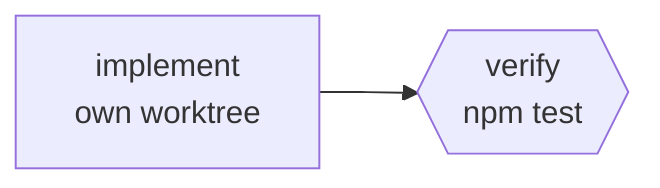

# geng

A DAG runner for AI coding agents: a node is a subprocess, an edge is a file, the exit code is the contract.

[](https://github.com/AdityaIndoori/graph-engineering/actions/workflows/ci.yml)
[](LICENSE)
[](https://www.python.org/downloads/)

One agent looping over ten jobs forgets job three by job thirty, and then grades its
own homework. `geng` runs the same work as a graph instead: each step is one
invocation of whatever agent CLI you already use, in its own context, with only
the tools it needs — and the steps that decide whether the work is any good are
test commands, not opinions.

It is a single ~550-line file with no dependencies outside the Python standard
library. Swapping Claude Code for Codex, OpenCode, Kiro, Gemini, Cursor, Amp or
aider is a one-line change.

## Table of contents

- [Try it in 60 seconds](#try-it-in-60-seconds)
- [Install](#install)
- [How it works](#how-it-works)
- [Use the harness you already have](#use-the-harness-you-already-have)
- [Three worked examples](#three-worked-examples)
- [When not to use this](#when-not-to-use-this)
- [Spec reference](#spec-reference)
- [Verified behaviour](#verified-behaviour)
- [Alternatives](#alternatives)
- [Contributing](#contributing)
- [License](#license)

## Try it in 60 seconds

You do not need an AI agent installed to see what this does. The bundled example
uses Python subprocesses as its "agents", so it runs anywhere:

```console
$ git clone https://github.com/AdityaIndoori/graph-engineering
$ cd graph-engineering
$ python geng.py run examples/smoke.toml

wave 1  (3 node(s), 4 at a time)
  ok   youtube
  ok   reddit
  ok   twitter

wave 2  (1 node(s), 4 at a time)
  ok   report

wave 3  (2 node(s), 4 at a time)
  ok   verify
  ok   flaky

6/6 ok, 0 failed, 0 skipped
```

Three nodes ran in parallel, a fourth joined their output into
`examples/build/report.md`, a gate checked the result, and a deliberately flaky
node retried until it passed. Run it again with `--resume` and every node is
cached in about a fifth of a second. Change one prompt and only that node and its
dependents re-run.

To see the shape without executing anything:

```console
$ python geng.py plan examples/smoke.toml
```

That prints a Mermaid diagram plus the execution waves.

## Install

There is nothing to install. Copy one file next to the repo you want to work in:

```console
$ curl -O https://raw.githubusercontent.com/AdityaIndoori/graph-engineering/main/geng.py
```

**Prerequisites**

| Requirement | Why |
| --- | --- |
| Python 3.11+ | `tomllib` entered the standard library in 3.11 |
| `git` | Only for `isolate = true` nodes; everything else works without it |
| An agent CLI | Any one of the eight below. Not needed for the example above |

There is deliberately no `pip install`. The entire premise is one file you drop
next to a repo and delete when you are done.

## How it works

You describe the graph in TOML. `geng` groups nodes into waves — every node whose
dependencies are already satisfied runs concurrently — and stops at the first
failed gate.

```toml
[agents.dev]
argv = ["claude", "-p", "--permission-mode", "acceptEdits"]

[agents.shell]
argv = ["bash", "-lc", "{prompt}"]

[nodes.implement]
agent   = "dev"
isolate = true                      # its own git worktree and branch
prompt  = "Add request-id logging to the HTTP layer."

[nodes.verify]
needs  = ["implement"]
agent  = "shell"
gate   = true                       # a failure here halts the whole graph
prompt = "npm test"
```



Four properties do the real work:

**The exit code is authoritative.** Not parsed stdout. Only Gemini and Kiro
publish exit-code tables; Cursor emits no valid JSON at all when it fails, and
Kiro and aider have no JSON mode. Any runner that parses output to decide success
is broken on arrival.

**Files are the state channel, not context windows.** Each node's stdout is
captured to `.geng/out/<node>.txt` and substituted into dependent prompts as
`{node}`. Referencing a node you did not declare in `needs` is a hard error, so
the spec's edges cannot quietly lie about what flows where.

**`isolate = true` gives a node its own git worktree and branch**, and commits its
work only if it succeeded. Two nodes can edit the same file concurrently without
touching each other or your checkout. A node that fails leaves nothing committed,
so a half-finished edit can never be mistaken for something reviewable.

**Resume is keyed on content.** Each node's key is
`sha256(id + prompt + argv + upstream keys)`, so `--resume` re-runs exactly the
subtree you invalidated and nothing else.

## Use the harness you already have

Every one of these exposes a non-interactive command and an exit code, which is
all `geng` needs. Ready-to-paste blocks live in [`adapters.toml`](adapters.toml).

| Harness | Adapter |
| --- | --- |
| Claude Code | `claude -p` &middot; `--allowedTools` &middot; `--bare` for CI |
| OpenAI Codex | `codex exec` &middot; `--sandbox read-only\|workspace-write` |
| OpenCode | `opencode run --auto` &middot; `--agent` |
| Kiro CLI | `kiro-cli chat --no-interactive` &middot; `--trust-tools=read,grep` |
| Gemini CLI | `gemini -p` &middot; `--output-format json` |
| Cursor | `cursor-agent -p -f` (without `-f` it proposes but never applies) |
| Amp | `amp -x` &middot; `--stream-json` |
| aider | `aider --yes-always --message` |

A read-only reviewer is an adapter, not an instruction — a node that cannot write
cannot "helpfully" fix the thing it was asked to judge:

```toml
[agents.review]
argv = ["claude", "-p", "--allowedTools", "Read,Grep,Glob,Bash(git diff:*)"]
```

## Three worked examples

| Example | Shape |
| --- | --- |
| [`examples/feature.toml`](examples/feature.toml) | plan (read-only) &rarr; implement (worktree) &rarr; **test suite as a gate** &rarr; two reviewers on different models &rarr; you decide |
| [`examples/migration.toml`](examples/migration.toml) | three isolated nodes, one owner per package, one `typecheck && test` barrier, then a read-only audit for missed callsites |
| [`examples/flaky.toml`](examples/flaky.toml) | reproduce &times;200 as a gate *before* theorising, three competing read-only hypotheses, one writer, then the same check inverted |

The last two show the shape worth internalising: **parallelise reading and
verifying, serialise writing and deciding.**

[`docs/pitch.html`](docs/pitch.html) is a nine-slide walkthrough of the same three
cases. [`docs/BACKGROUND.md`](docs/BACKGROUND.md) covers where the term "graph
engineering" came from and what is genuinely new about it.

## When not to use this

Most work does not need a graph, and this is the rare topic where the people
selling the idea agree with the sceptics. Reach for one on exactly three triggers:

1. **Context rot** — a single agent's window is hitting 300–500k tokens per iteration.
2. **Independent review** — the stakes are high enough that the author must not be the judge.
3. **Wall-clock** — genuinely independent subtasks are running in sequence.

Otherwise keep your loop. A graph costs you three prompts to maintain instead of
one, a state schema between nodes, and a new class of routing bugs. Agents burn
roughly 4&times; the tokens of chat and multi-agent systems roughly 15&times;;
Anthropic's own guidance is that *"most coding tasks involve fewer truly
parallelizable tasks than research."* Your review bandwidth, not the tool's
concurrency limit, is the real ceiling.

## Spec reference

```toml
[settings]
default_agent = "claude"   # per-node `agent` overrides this
max_parallel  = 4          # concurrent nodes within a wave
base_ref      = "HEAD"     # branch point for isolate = true

[agents.<name>]
argv       = ["claude", "-p"]  # `{prompt}` placeholder, else the prompt is appended
prompt_via = "arg"             # or "stdin"
ok_exit    = [0]               # exit codes that count as success
env        = { KEY = "value" }

[nodes.<id>]
agent   = "claude"
prompt  = "…{upstream}…{upstream_path}…"
needs   = ["upstream"]   # the edges
out     = "build/x.md"   # also copy stdout here
gate    = true           # failure halts the whole graph
isolate = true           # own git worktree + branch
retries = 2              # exponential backoff, capped at 15s
timeout = 900            # seconds
cwd     = "packages/api"
```

Placeholders available in a prompt: `{dep}` (upstream stdout), `{dep_path}`,
and for isolated upstreams `{dep_branch}`, `{dep_worktree}`, `{dep_commit}`.
`{python}` resolves to the running interpreter, and `{graph_root}` to the spec's
directory. Nodes also receive `GENG_NODE`, `GENG_OUT`, `GENG_ROOT` and
`GENG_BRANCH` in their environment.

Commands:

```console
$ python geng.py run graph.toml
$ python geng.py run graph.toml --resume        # skip nodes already green
$ python geng.py run graph.toml --only test     # deps pulled in automatically
$ python geng.py run graph.toml --dry-run       # print argv, change nothing
$ python geng.py plan graph.toml                # mermaid + wave preview
```

Run state lives in `.geng/` beside the spec: `state.json` (status, exit code,
attempts, content key), `out/<node>.txt` (edge payloads), `log/<node>.log` (argv,
cwd, exit, stdout, stderr) and `wt/<node>/` (worktrees). Add `.geng/` to your
`.gitignore`.

## Verified behaviour

`python -m unittest discover tests` runs 40 tests on Linux, macOS and Windows
across Python 3.11–3.13. They assert the properties that would otherwise be
claims:

- wave layering, and that a node never runs before its deepest dependency
- an undeclared `{placeholder}` fails the node instead of rendering empty
- editing one prompt invalidates that node **and its descendants**, nothing else
- a failed gate halts the graph and returns exit 1; dependents are skipped
- `retries = 2` records exactly three attempts before succeeding
- `--dry-run` creates no artifacts, no state file and no worktrees
- twelve parallel nodes all land in `state.json` without corrupting it
- two isolated nodes writing the same file commit to separate branches while the
  main checkout stays untouched
- a failed isolated node publishes **no** commit
- a missing executable is reported as `exit=127`, and `timeout` as `exit=124`

`python tools/audit_deck.py` checks the slide deck against published limits
(&le;21.2 mean words per slide, &le;6 code lines per pane, &ge;24px code).

## Alternatives

`geng` exists because none of these are a single file you can drop next to a repo
with no infrastructure — but each is more capable, and if you already run one, use it.

- **`make -j`** — free incremental resume via mtime; the original DAG runner
- **GitHub Actions `needs:`** — artifacts as edges, `rerun --failed` as resume
- **LangGraph** — typed state channels, checkpointers, first-class human-in-the-loop
- **Temporal / DBOS / Restate / Inngest** — durable execution, idempotency keys, retries
- **Dagster / Prefect** — asset lineage and scheduling
- **Claude Code dynamic workflows / Kiro specs** — excellent, and locked to one vendor

## Contributing

Issues and pull requests are welcome. Please run `python -m unittest discover tests`
before opening a PR, and keep `geng.py` dependency-free — the standard library
only. See [CONTRIBUTING.md](CONTRIBUTING.md).

## License

[MIT](LICENSE) &copy; 2026 Aditya Indoori
